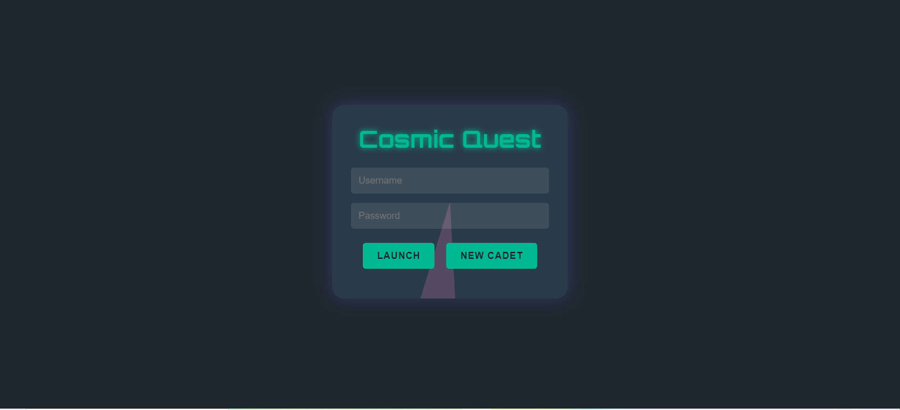

# Learning_game




# Math Mastery Game

Math Mastery Game is an engaging and interactive learning app designed to help learners advance their mathematics skills in a fun and rewarding way. The app challenges players with math questions, and correct answers help their chosen avatar climb up a block tower.

## Features

- **Personalized Learning:** Players can choose an avatar to represent them during the game.
- **Interactive Gameplay:** Players answer math questions, and correct answers move their avatar up a block.
- **Skill Advancement:** A variety of math topics are covered to reinforce key skills and concepts.
- **Dynamic Feedback:** Instant feedback on answers to help learners understand and improve.
- **Engaging Design:** Visual and audio elements keep players motivated and excited.

## Technologies Used

- **Frontend:** HTML, CSS, and JavaScript
- **Backend:** Django (Python)
- **Database:** SQLite (Django default)
- **Interactivity:** JavaScript to handle game dynamics and avatar movements

## How to Play

1. **Start the Game:**
   - Choose your avatar from the available options.
2. **Answer Questions:**
   - Solve math questions that appear on the screen.
   - Submit your answer to see if it’s correct.
3. **Climb the Blocks:**
   - For each correct answer, your avatar moves up one block.
   - Reach the top to complete the level and unlock new challenges!
4. **Track Progress:**
   - Monitor your score and levels completed.

## Installation and 

## 2.Set Up the Virtual Environment:

bash
Copy code
python -m venv venv
source venv/bin/activate   # On Windows: venv\Scripts\activate

## 3. Install Dependencies:

bash
Copy code
pip install -r requirements.txt

## 4. Apply Migrations:

bash
Copy code
python manage.py migrate

## 5. Run the Server:

bash
Copy code
python manage.py runserver

## 6. Open in Browser:

Future Improvements
Add a leaderboard to display top players.
Include more math topics and difficulty levels.
Add sound effects for correct and incorrect answers.
Create a multiplayer mode for competitive learning.
Contributing
Contributions are welcome! Feel free to open an issue or submit a pull request to improve the game.

License
This project is licensed under the MIT License.

Acknowledgments
Inspired by the passion for helping learners achieve math mastery.
Special thanks to the open-source community for the tools and frameworks used in this project.
css
Copy code

Feel free to modify the content to suit your specific project details and add any additional features or instructions.

1. **Clone the Repository:**
   ```bash
   git clone https://github.com/yourusername/math-mastery-game.git
   cd math-mastery-game
